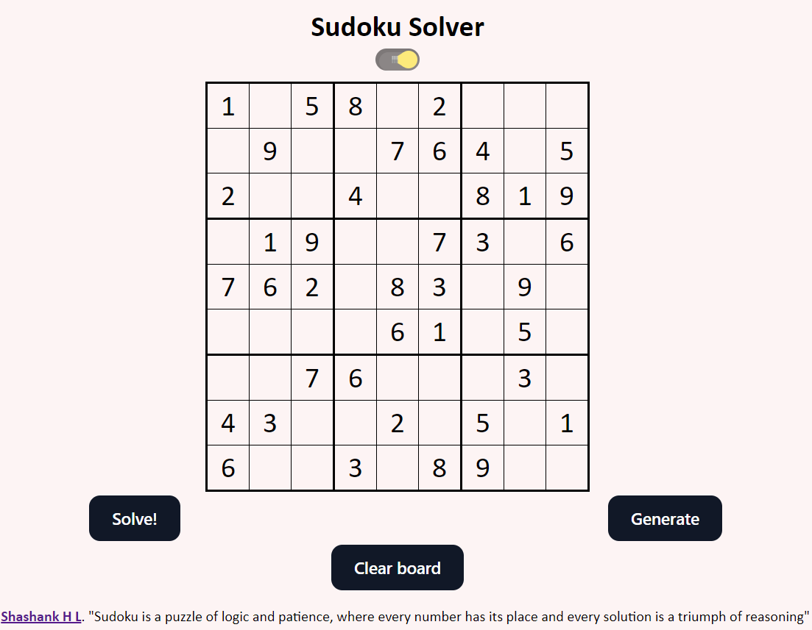

# Sudoku Solver

A Sudoku solver is a program or algorithm designed to automatically solve Sudoku puzzles, which are logic-based number-placement puzzles. The solver typically takes an unsolved Sudoku grid as input and produces a solved grid as output.

Click here for a <a target="_blank" href="https://shashankhl.github.io/sudoku-solver/"> DEMO </a>



## Setup

Clone the repository

```
$ git clone https://github.com/shashankhl/sudoku-solver.git
```

```
$ run on live server
```

## About

Sudoku solver algorithms, particularly those utilizing backtracking, offer efficient and elegant solutions to unraveling the complexities of Sudoku puzzles. Backtracking, a fundamental technique in solving constraint satisfaction problems, empowers solvers to efficiently explore the solution space, intelligently discarding dead-end paths, and ultimately finding the correct solution.

The process typically begins with initializing an empty Sudoku grid, followed by iteratively placing numbers in empty cells while adhering to the Sudoku rules - each row, column, and 3x3 subgrid must contain unique digits from 1 to 9. When a cell becomes empty, the solver backtracks to the previous decision point, exploring alternative possibilities until a valid solution is found or all options are exhausted.

The magic of backtracking lies in its ability to systematically navigate through the puzzle's branching possibilities, eliminating invalid choices and swiftly progressing towards the correct solution. As the solver explores deeper into the puzzle, it leverages the power of recursion to handle the complexities of multiple decision points, efficiently pruning branches that lead to dead-ends.

Furthermore, backtracking-based Sudoku solvers often incorporate intelligent strategies to optimize performance and reduce computational overhead. These strategies may include constraint propagation techniques, such as hidden singles and naked pairs, which help identify and prioritize candidate digits for each cell, thus guiding the backtracking process towards quicker convergence.

In summary, Sudoku solvers utilizing backtracking exemplify the beauty of algorithmic problem-solving, seamlessly blending recursive exploration with strategic decision-making to conquer the intricate challenges posed by Sudoku puzzles. Through the application of backtracking, these solvers transform Sudoku from a perplexing enigma into a solvable delight, showcasing the elegance and efficiency of computational problem-solving techniques.
